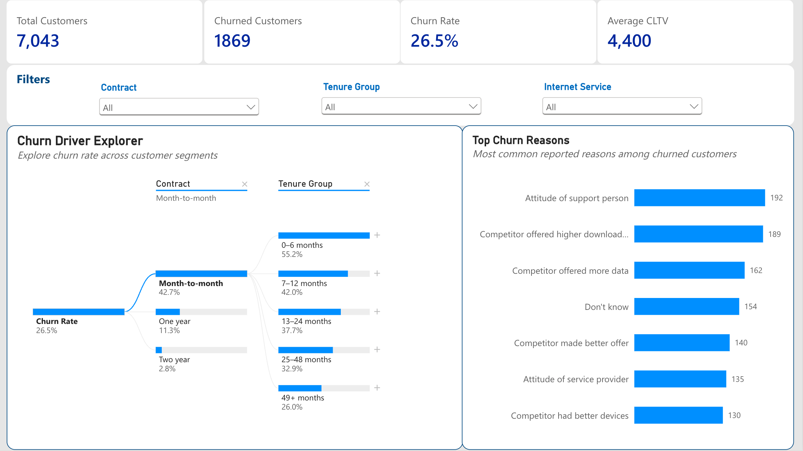
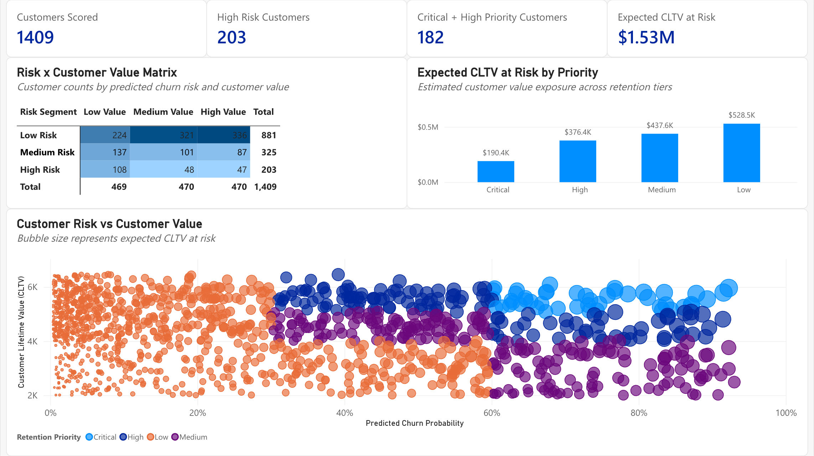

# IBM Telecom Customer Churn & Retention Analysis

An end-to-end customer churn analytics project using **SQL, Python, machine learning, and Power BI** to identify churn drivers, predict customer churn risk, prioritize high-value customers for retention, and communicate actionable insights through an interactive business dashboard.

## Business Problem

Customer churn directly affects recurring revenue and long-term customer value. A telecom company wants to better understand:

- Which customers are most likely to churn?
- What customer, service, contract, and billing characteristics are associated with churn?
- Which customers should be prioritized for retention efforts?
- How can churn risk be combined with customer value to support business decisions?
- How can analytical and predictive results be communicated through an interactive business dashboard?

The goal of this project is to build a data-driven retention framework that moves beyond simply predicting churn.

The final solution combines **predicted churn probability**, **Customer Lifetime Value (CLTV)**, customer characteristics, and interactive Power BI reporting to identify high-priority customers and support targeted retention actions.

## Project Objectives

1. Clean and validate the customer dataset.
2. Analyze churn patterns using SQL and Python.
3. Identify important churn-related customer segments.
4. Engineer leakage-safe features for predictive modeling.
5. Compare multiple classification models.
6. Generate customer-level churn probabilities.
7. Combine churn risk with CLTV to create retention-priority tiers.
8. Produce an actionable customer retention list.
9. Develop an interactive Power BI dashboard for churn monitoring and retention prioritization.

## Dataset

This project uses the **IBM Telco Customer Churn** dataset.

- Customers: **7,043**
- Variables: **33**
- Target: `Churn Value`
  - `1` = Churned
  - `0` = Retained

The dataset contains customer demographics, tenure, phone and internet services, add-on services, contract type, billing and payment methods, monthly and total charges, churn status and churn reason, and Customer Lifetime Value (CLTV).

Dataset source:  
https://www.kaggle.com/datasets/yeanzc/telco-customer-churn-ibm-dataset

> The raw dataset is not required to understand the analysis. Processed datasets used throughout the project are included in `data/processed/`.

## Project Workflow

```text
Raw Customer Data
        ↓
01 — Data Preparation
        ↓
02 — SQL Business Analysis
        ↓
03 — Exploratory Data Analysis
        ↓
04 — Feature Engineering
        ↓
05 — Churn Modeling
        ↓
06 — Retention Strategy
        ↓
Customer Retention Action List
        ↓
Power BI Business Dashboard
```

## 1. Data Preparation

Notebook: [`notebooks/01_data_preparation.ipynb`](notebooks/01_data_preparation.ipynb)

The raw dataset was inspected and prepared for analysis and modeling.

Key steps included:

- validating 7,043 customer records;
- checking duplicate customers and missing values;
- converting `Total Charges` to numeric;
- handling 11 structurally missing `Total Charges` values for zero-tenure customers;
- validating consistency between `Churn Label` and `Churn Value`;
- identifying constant, redundant, high-cardinality, and leakage-prone variables;
- creating separate datasets for business analysis and predictive modeling.

### Data Leakage Controls

The following fields were excluded from churn prediction:

- `Churn Label` — duplicate representation of the target;
- `Churn Score` — existing churn-derived score;
- `Churn Reason` — only known after a customer has churned.

Exact geographic identifiers and other non-predictive fields were also excluded from the initial model.

## 2. SQL Business Analysis

Notebook: [`notebooks/02_sql_business_analysis.ipynb`](notebooks/02_sql_business_analysis.ipynb)  
SQL file: [`sql/02_sql_business_analysis.sql`](sql/02_sql_business_analysis.sql)

SQL was used to investigate the main business questions, including:

- overall customer and churn KPIs;
- churn by contract type;
- churn by tenure;
- churn by internet service;
- churn by payment method;
- billing behavior;
- demographic differences;
- service and support features;
- CLTV segments;
- historical churn reasons;
- highest-value customers lost to churn.

The SQL analysis establishes the descriptive business context before predictive modeling.

## 3. Exploratory Data Analysis

Notebook: [`notebooks/03_exploratory_data_analysis.ipynb`](notebooks/03_exploratory_data_analysis.ipynb)

Python was used for deeper exploratory analysis and visualization.

### Key Findings

| Finding | Result |
|---|---:|
| Overall churn rate | **26.5%** |
| Month-to-month contract churn rate | **42.7%** |
| 0–6 month tenure churn rate | **52.9%** |
| Electronic check churn rate | **45.3%** |
| Fiber optic churn rate | **41.9%** |

The analysis suggests that churn is particularly concentrated among customers with:

- short tenure;
- month-to-month contracts;
- electronic-check payments;
- fiber-optic internet service;
- no or limited support/security services.

These relationships are descriptive associations and should not be interpreted as causal effects.

Selected figures are available in:

[`outputs/figures/`](outputs/figures/)

## 4. Feature Engineering

Notebook: [`notebooks/04_feature_engineering.ipynb`](notebooks/04_feature_engineering.ipynb)

Three interpretable features were engineered:

- `Num Addon Services`
- `Automatic Payment`
- `Month-to-Month`

### Modeling Design

- Train/test split: **80/20**
- Stratified by churn outcome
- Random state: **42**
- Training observations: **5,634**
- Test observations: **1,409**
- Churn rate in both sets: **26.54%**

Numeric features were processed using median imputation and standardization.

Categorical features were processed using most-frequent imputation and one-hot encoding.

After preprocessing, the feature space contained **49 model-ready features**.

### Why CLTV Was Excluded from the Churn Model

`CLTV` was intentionally excluded from churn prediction and reserved for the final business decision stage:

```text
Predicted Churn Risk + CLTV → Retention Priority
```

This keeps customer value separate from churn likelihood and makes the retention strategy easier to interpret.

## 5. Churn Modeling

Notebook: [`notebooks/05_churn_modeling.ipynb`](notebooks/05_churn_modeling.ipynb)

Three classification models were compared:

- Logistic Regression
- Random Forest
- Gradient Boosting

Because churn is an imbalanced classification problem, model performance was evaluated using multiple metrics rather than accuracy alone.

### Model Performance

| Model | Accuracy | Precision | Recall | F1 | ROC-AUC | PR-AUC |
|---|---:|---:|---:|---:|---:|---:|
| **Gradient Boosting** | **0.800** | **0.650** | 0.532 | 0.585 | **0.852** | **0.670** |
| Logistic Regression | 0.742 | 0.510 | **0.778** | **0.616** | 0.849 | 0.645 |
| Random Forest | 0.786 | 0.590 | 0.642 | 0.615 | 0.846 | 0.650 |

### Selected Model

**Gradient Boosting** was selected as the final model because it achieved the highest:

- ROC-AUC: **0.8523**
- PR-AUC: **0.6696**

The final business workflow uses the model's **predicted churn probability** rather than relying only on binary churn predictions.

This allows customers to be ranked by relative churn risk and supports more flexible retention prioritization.

## 6. Retention Strategy

Notebook: [`notebooks/06_retention_strategy.ipynb`](notebooks/06_retention_strategy.ipynb)

The final stage combines:

```text
Churn Probability + CLTV + Customer Characteristics
```

to create actionable retention priorities.

### Churn Risk Segments

- **Low Risk:** < 30%
- **Medium Risk:** 30% to < 60%
- **High Risk:** ≥ 60%

### Customer Value Segments

Customers are divided into:

- Low Value
- Medium Value
- High Value

using CLTV terciles.

### Retention Priority Framework

| Churn Risk | Customer Value | Priority |
|---|---|---|
| High | High | **Critical** |
| High | Medium | **High** |
| Medium | High | **High** |
| High | Low | **Medium** |
| Medium | Medium | **Medium** |
| Medium | Low | Low |
| Low | Any | Low |

A simple prioritization metric was also created:

```text
Expected CLTV at Risk = Predicted Churn Probability × CLTV
```

This is used as a prioritization score rather than a formal financial valuation.

### Retention Results

On the held-out test set:

| Metric | Result |
|---|---:|
| Customers scored | **1,409** |
| High-risk customers | **203** |
| Critical-priority customers | **47** |
| Critical + High-priority customers | **182** |
| Total CLTV | **6,178,580** |
| Expected CLTV at risk | **1,532,924** |
| Expected CLTV at risk among Critical + High customers | **566,781** |

The final action list also assigns customer-level risk factors and suggested retention actions such as:

- longer-term contract incentives;
- automatic payment enrollment;
- discounted or trial technical support;
- online security bundles;
- loyalty pricing reviews;
- new-customer onboarding outreach.

The full customer retention action list is available in:

[`outputs/tables/customer_retention_action_list.csv`](outputs/tables/customer_retention_action_list.csv)

## 7. Power BI Dashboard

An interactive **two-page Power BI dashboard** was developed to translate the analytical and predictive results into business-facing insights.

The dashboard connects descriptive churn analysis with the customer-level retention framework and allows users to interactively explore customer segments, churn risk, customer value, and retention priorities.

### Page 1 — Customer Churn Overview

The first page focuses on understanding the overall churn problem and identifying the customer segments associated with higher churn.

Key components include:

- **Total Customers**
- **Churned Customers**
- **Churn Rate**
- **Average CLTV**
- interactive churn-driver exploration;
- filtering by contract type, tenure group, and internet service;
- top reported churn reasons.

The **Churn Driver Explorer** uses an interactive decomposition tree to investigate churn rates across customer characteristics such as contract type and tenure.

The **Top Churn Reasons** visualization summarizes the most commonly reported reasons among customers who actually churned.

> `Churn Reason` is used only for descriptive analysis because it is only known after cancellation and was excluded from predictive modeling to prevent data leakage.



### Page 2 — Retention Priority

The second page converts predictive modeling results into a retention decision-support tool.

Key KPIs include:

- **1,409 customers scored**
- **203 high-risk customers**
- **182 Critical + High-priority customers**
- approximately **$1.53M Expected CLTV at Risk**

The page contains three main interactive visualizations.

#### Risk × Customer Value Matrix

Customers are segmented simultaneously by:

```text
Predicted Churn Risk × Customer Value
```

The heatmap shows how the scored customer population is distributed across Low, Medium, and High risk and value groups.

This provides a visual representation of the retention-priority framework.

#### Expected CLTV at Risk by Priority

Expected CLTV at Risk is aggregated across:

- Critical
- High
- Medium
- Low

retention tiers.

This helps quantify where customer value exposure is concentrated.

#### Customer Risk vs Customer Value

A customer-level bubble chart plots:

- **X-axis:** predicted churn probability
- **Y-axis:** Customer Lifetime Value
- **Bubble size:** Expected CLTV at Risk
- **Color:** Retention Priority

This makes it possible to visually identify customers who combine:

- high churn probability;
- high customer value;
- high expected value at risk.

Interactive tooltips provide additional customer-level context, including risk segment, value segment, key risk factors, and recommended retention actions.



### Dashboard Purpose

The Power BI report moves the project from static analysis to interactive decision support.

The two-page structure answers two complementary business questions:

```text
Page 1:
Where is churn concentrated and what customer characteristics are associated with it?

Page 2:
Which customers should retention teams prioritize and how much customer value is at risk?
```

## Tools & Technologies

### Python

- pandas
- NumPy
- Matplotlib
- scikit-learn

### SQL

- SQLite

### Business Intelligence

- Power BI
- DAX
- Power Query

### Development & Documentation

- Jupyter Notebook
- GitHub

## Key Business Takeaway

A churn model is most useful when it supports a business decision rather than only producing a classification.

This project demonstrates an end-to-end framework that:

1. identifies historical churn patterns;
2. predicts customer-level churn risk;
3. separates customer value from churn likelihood;
4. combines risk and value to prioritize retention efforts;
5. generates customer-level retention recommendations;
6. communicates the results through an interactive Power BI dashboard.

The resulting framework allows a telecom company to focus retention resources on customers who are both **likely to leave** and **valuable to retain**.

## Limitations & Future Work

Potential extensions include:

- tuning model hyperparameters using cross-validation;
- calibrating predicted probabilities;
- optimizing retention thresholds using campaign costs and expected savings;
- estimating the financial impact of specific retention offers;
- validating retention recommendations through A/B testing;
- incorporating longitudinal customer usage data;
- integrating live or regularly refreshed customer data into the Power BI dashboard;
- tracking retention campaign outcomes over time.

## Author

**Dabin Choi**

GitHub: https://github.com/dabinchoi04
